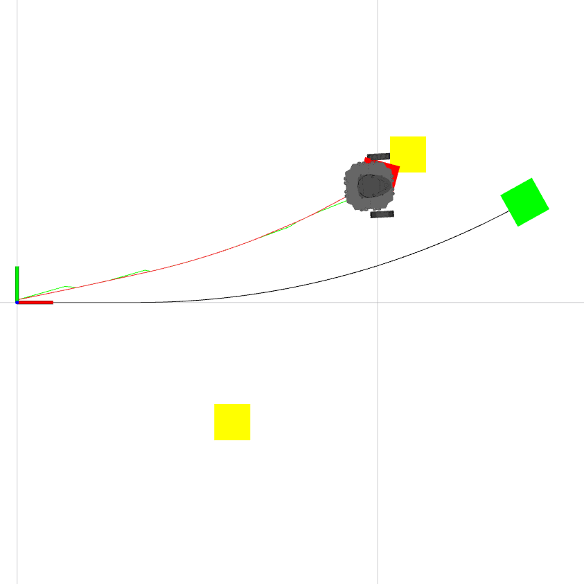

# Package: slam

Authors: Aakin Desai and Nithin Gunamgari

## Package Summary

This incorporates EKF SLAM on the Turtlebot3.

### EKF SLAM

For EKF SLAM, refer to [this SLAM resource](https://ieeexplore.ieee.org/document/938381) and [this EKF resource](https://www.cs.unc.edu/~welch/media/pdf/kalman_intro.pdf) for the details on notation.

**The process model:**

In the process of observing a landmark, the following kinematics is used to predict the vehicle state.

  

The landmarks in the environment are assumed to be stationary point targets. The landmark process model is
thus:

 

**The observation model:**

It returns the range and bearing to a landmark i. The last terms are the noise incorporated. (Here, we used fake sensing data with added noise). 

**Time update:**

Here we project the state and covariance estimates from the previous time step k-1 to the current time step k. The non-linear function relates the states at k-1 and k time steps.

Project the error covariance ahead

**Measurement update:**

To correct the state and covariance estimates with the measurement

Compute the Kalman gain

Update estimate with measurement zk

Update the error covariance

Loop over the above updates for every time step.

EKF Slam with Gazebo landmarks

Green block - Odometry with black path
Red block - EKF Slam with green path
Robot - Turtlebot3 gazebo path in red
